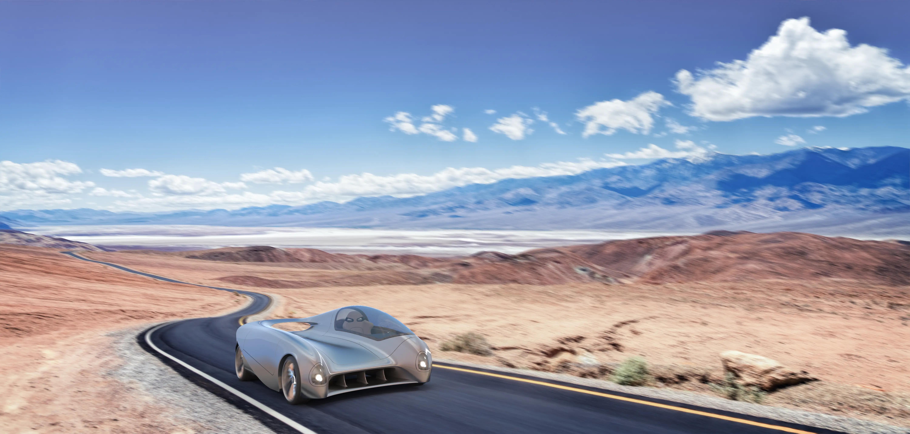

# smoove-ride

**Fictive site for Geely (school project).** _[LINK](https://smoove-official.netlify.app)_

_"Geely will launch a new innovative product: car / motorcycle optional. They are investing in a new futuristic model to dominate the industry. The landing page should provide information about the new model in overview images and in detail. The product page will be launched in early February 2022._

_The site must therefore breathe design, modernity, technology, innovation, smooth. The customer wants the brand to be different from the rest of Geely and they want you to take the turns in the design."_

# Installation

- Clone repo
- Run in localhost

# Technologys used

- HTML
- SCSS
- JavaScript
- Figma
- Autodesk 3ds Max
- Adobe Photoshop

# Creators

- Johanna Øien _(design)_
- David Neråfors _(design)_
- Sofia Dersén _(web developer)_
- Christopher Michael _(web developer)_
- Sara Skog _(computer graphics)_
- Jakob Assarsson _(computer graphics)_
